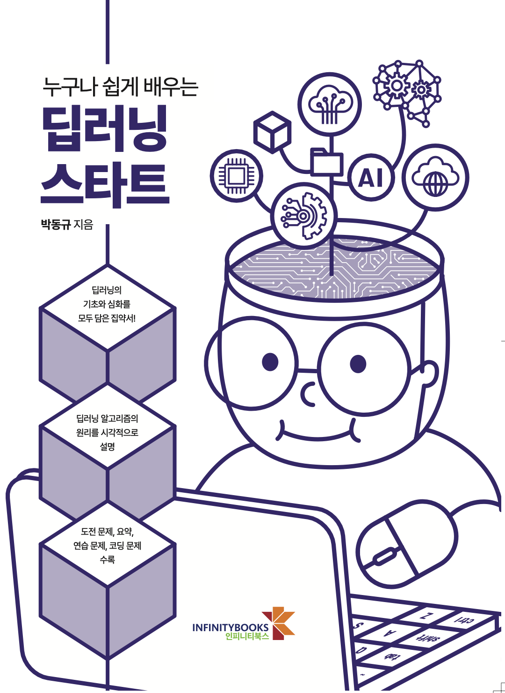

# 인피니티 북스 "누구나 쉽게 배우는 딥러닝 스타트" 저장소

  

* 온라인 구매 링크 : [[YES24]](http://www.yes24.com/Product/Goods/89140722)

***
# "누구나 쉽게 배우는 딥러닝 스타트" 저장소 소개

안녕하세요 독자여러분 이곳은 인피니티 북스의 *"누구나 쉽게 배우는 딥러닝 스타트"* 관련 저장소입니다.
이 책의 소스코드와 주피터 노트북 파일, colab 주소, 정오표등 다양한 자료와 정보를 업로드할 예정입니다.

"누구나 쉽게 배우는 딥러닝 스타트"는 오늘날 인공지능의 핵심을 이루는 딥러닝을 처음 배우는 입문자와 새롭게 딥러닝 개발에 도전하는 개발자를 위한 책입니다.
이 책은 다음과 같은 특징이 있습니다.
'''
딥러닝의 기초부터 심화 과정을 모두 담은 집약서!

『누구나 쉽게 배우는 딥러닝 스타트』는 딥러닝의 핵심을 시각적인 설명과 여러 가지 파이썬 코드를 통해 알려준다. 동시에 실생활에서 쓰이고 있는 인공지능 기술에 대한 내용을 더 깊이 알려주는 지침서이다. ChatGPT, 알파고, 생성 인공지능 등 대부분의 인공지능 분야에서 딥러닝 기술을 이용하는데, 실제로 어떤 원리로 어떻게 실행되는지 알기 쉽게 설명하는 책은 여전히 부족한 실정이다. 『누구나 쉽게 배우는 딥러닝 스타트』는 이러한 교육 현장의 요구에 따라 집필되었으며, 딥러닝에 대한 궁금증을 느꼈던 독자들에게 명쾌한 해답을 제시하는 돌파구가 되어 줄 것이다.

본서의 특징은 다음과 같다. 첫 번째, 엄선된 파이썬 코드를 제공하여 독자가 구글 코랩 환경에서 직접 실행해 볼 수 있도록 구성하였다. 두 번째, 딥러닝의 기반이 되는 기초 수학 내용을 포함하여 독자가 더욱 이해하기 쉽도록 하였다. 세 번째, 최근 주목받으며 활발히 연구되고 있는 기술인 생성 인공지능에 대해 기술하며 딥러닝을 상세히 다뤘다. 네 번째, 요즘 부상하고 있는 ChatGPT에 사용된 기술인 트랜스포머 모델과 다른 대규모 언어 모델을 설명하여 딥러닝 기술에 대한 이해도를 높였다.

이처럼 『누구나 쉽게 배우는 딥러닝 스타트』는 딥러닝과 관련된 지식들을 폭넓게 다루고 있다. 또한 기초 수학 지식부터 심화 학습까지 총망라하여 딥러닝의 A to Z를 학습할 수 있도록 하였다. 본서를 통해 딥러닝의 개념을 습득한다면, 실제 데이터 환경에서 AI 활용 능력이 극대화되는 경험을 할 수 있을 것이다.
'''

### 함께 보면 좋은 책
책을 읽은 후 파이썬과 데이터 다루기, 머신러닝에 관련된 저자들의 책을 함께 보면 더 좋습니다. 

* (따라하며 배우는) 파이썬과 데이터 과학, 천인국, 박동규, 강영민, 생능출판사 (2020)
  * [[YES24]](http://www.yes24.com/Product/Goods/96555988), [[인터파크]](http://book.interpark.com/product/BookDisplay.do?_method=detail&sc.shopNo=0000400000&sc.prdNo=345271510&sc.saNo=003002001&bid1=search&bid2=product&bid3=title&bid4=001), [[교보문고]](http://www.kyobobook.co.kr/product/detailViewKor.laf?ejkGb=KOR&mallGb=KOR&barcode=9788970504773&orderClick=LEa&Kc=) 
* 으뜸 머신러닝, 강영민, 박동규, 김성수, 생능출판사 (2021)
  * [[YES24]](http://www.yes24.com/Product/Goods/102577953), [[인터파크]](http://book.interpark.com/product/BookDisplay.do?_method=detail&sc.shopNo=0000400000&sc.prdNo=352099030&sc.saNo=003002001&bid1=search&bid2=product&bid3=title&bid4=001), [[교보문고]](http://www.kyobobook.co.kr/product/detailViewKor.laf?ejkGb=KOR&mallGb=KOR&barcode=9788970504919&orderClick=LEa&Kc=)

  
  

### 사전 지식

이 저장소의 코드를 실행하기 위해서는 다음 웹 사이트에 접속하여 파이썬 IDLE를 다운받아 설치하여야 합니다.
   * https://www.python.org/

혹은 다음의 구글 colab 웹사이트에 접속하여(구글 계정이 필요함) 노트북 환경에서 파이썬 코딩을 할 수 있습니다.
   * https://colab.research.google.com/

# 강의 PPT
* 이 책으로 강의를 하실분을 위한 강의 PPT가 제공됩니다.
* 강의 PPT 자료 : https://infinitybooks.co.kr/ 교수회원으로 로그인 후 강의자료 다운로드가 가능합니다.

## "으뜸 파이썬" 정오표
* 이 책의 정오표는 다음 저장소를 보시기 바랍니다(책의 오류로 불편을 드린점 사과드립니다)
  * [정오표](https://github.com/dongupak/DLstart/errata.md)

### 도움이 될만한 파이썬 동영상 강좌
* 널널한 교수의 으뜸 파이썬 Youtube 강좌
  * https://www.youtube.com/playlist?list=PL2P1Vm9k53HOflCAdyYaOx7hfBHydWNcL
* 널널한 교수의 기초 파이썬 Youtube 강좌
  * https://www.youtube.com/watch?v=TK6RLGaM3Ao&list=PL2P1Vm9k53HOEn-QYXAfblQWkR0OW9mKX
* 널널한 교수의 고급 파이썬 Youtube 강좌
  * https://www.youtube.com/watch?v=HYg_Zp1186M&list=PL2P1Vm9k53HMUI3i_UKRfWc3ePzAVerhc
* "따라하며 배우는 파이썬과 데이터 과학(2020 출판)" Youtube 강좌
  * https://www.youtube.com/playlist?list=PL2P1Vm9k53HOD_lesbnzAS51t71QeOPms

***
## 기여하실 분

이 코드에 이상이 있거나 기여를 하실 분은 Fork후에 Request를 주시기 바랍니다.

## 버저닝

이 저장소는 으뜸 파이썬 1판의 저장소로 2판, 3판에 따라 각각 다른 버전이 나타날 수 있습니다.

## 저자
열린 마음으로 독자여러분의 의견을 받습니다. 책에 관련된 문의는 언제든 아래 이메일로 보내 주십시오.
* **박 동규** - *창원대학교 정보통신공학과 교수* 
  * [박동규교수 저장소](https://github.com/dongupak)
  * 이메일 : dongupak@gmail.com

## 저작권
* 이 코드의 소유권은 모든 저자에게 있으나 비상업적 용도에 한해 자유롭게 이용가능하며 재배포 가능합니다.
* 출판물을 무단 복제하거나 저자의 허락없이 배포하는 것은 법에 위반되는 행위입니다.

# 책의 LAB과 연습문제 정답지 제공에 관하여
이 책에는 많은 도전 문제와 심화문제가 제공됩니다. 저자들이 모든 문제에 대해 답을 만들어 보았지만, 이것은 문제의 유효성을 검증하기 위한 것일 뿐입니다.  
이 책의 문제는 답이 제시되지 않은 문제의 해답을 찾는 과정과 실습을 통해 더 깊은 학습을 할 수 있도록 준비된 것입니다.
이에 저자는 정답지 제공을 하지 않음을 다시한번 알려드립니다.

